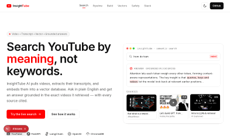
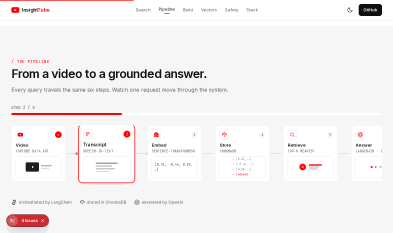
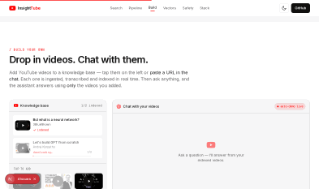
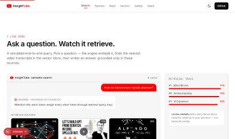
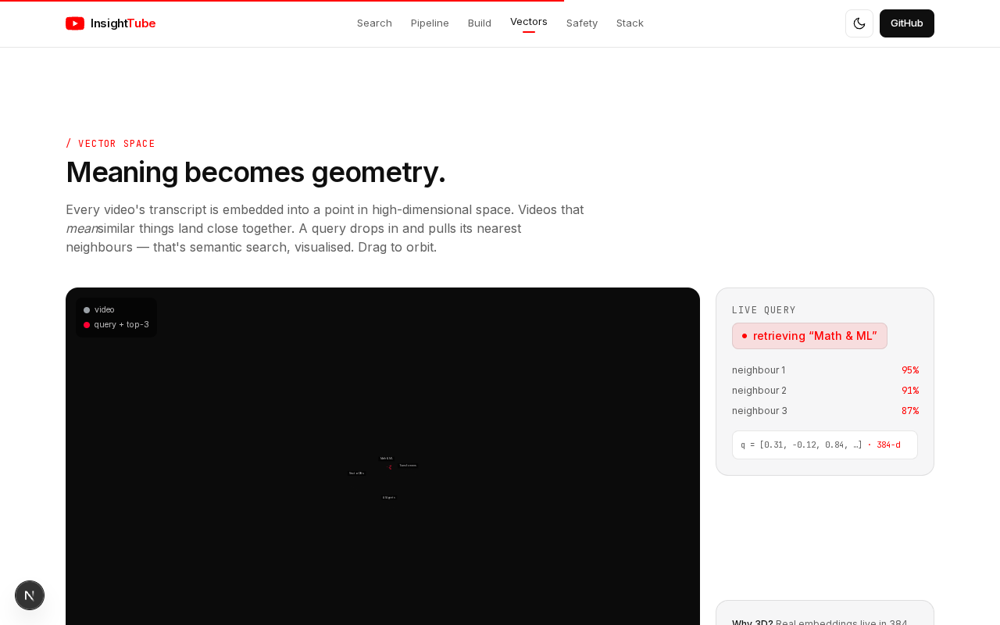
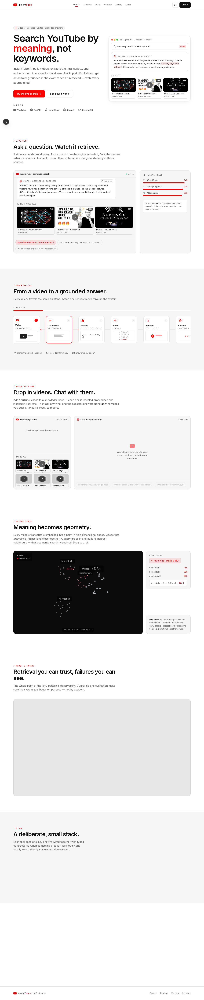

# InsightTube AI

[](https://www.python.org/downloads/)
[](https://fastapi.tiangolo.com/)
[](https://streamlit.io/)
[](https://python.langchain.com/)
[](LICENSE)

Semantic search and AI analysis over YouTube data. Pull videos by query or channel, embed the metadata, and ask natural-language questions about what's there.

A keyword search catches what people said. A semantic search catches what they meant. The gap is where this project lives.

## 🎬 Interactive Landing Page

This repo ships with an animated marketing site (Next.js + React Three Fiber) in [`/landing`](./landing) that visualises the entire pipeline — semantic search, the data pipeline, and the vector space. Preview it right here, no click needed:

| Hero — search by meaning | Live pipeline |
|:---:|:---:|
|  |  |

| Drop-in videos → chat | Semantic search demo |
|:---:|:---:|
|  |  |

**Vector space:** every transcript becomes a point in high-dimensional space; a query drops in and pulls its nearest neighbours — that's semantic search, visualised in 3D.



**Full page (light mode):**



> 🌐 **Live site:** https://insighttube-ai.vercel.app · light/dark mode · fully responsive.
> Run locally: `cd landing && npm install && npm run dev` → http://localhost:3000

## What it does

**Semantic query.** You ask a question in plain English. Sentence-transformers embeds it, ChromaDB returns the top-k most similar videos by vector distance, LangChain builds a prompt with those videos as context, and OpenAI writes the answer. The dashboard shows the answer alongside the sources it pulled from. If the retrieval misses, the answer is wrong in a specific way you can see — that visibility is the whole reason for the RAG pattern.

**Content analysis.** Run a corpus through the engine and get scores for category, sentiment, and engagement. The dashboard wants something to display while you're not asking questions.

## Architecture

```
┌─────────────────┐    ┌─────────────────┐    ┌─────────────────┐
│   Streamlit     │    │   FastAPI       │    │   AI Engine     │
│   Dashboard     │◄──►│   Backend       │◄──►│   (LangChain)   │
│   (Port 8501)   │    │   (Port 8000)   │    │                 │
└─────────────────┘    └─────────────────┘    └─────────────────┘
         │                       │                       │
         ▼                       ▼                       ▼
┌─────────────────┐    ┌─────────────────┐    ┌─────────────────┐
│   Data Models   │    │   Config Mgmt   │    │   Vector Store  │
│   (Pydantic)    │    │   (Settings)    │    │   (ChromaDB)    │
└─────────────────┘    └─────────────────┘    └─────────────────┘
```

Streamlit talks to FastAPI. FastAPI talks to LangChain. LangChain queries Chroma and calls OpenAI. Pydantic enforces shape on everything moving between them. Each piece runs in its own container.

## Stack

FastAPI, Pydantic, Uvicorn for the backend. Streamlit and Plotly for the dashboard. LangChain, OpenAI, ChromaDB, and sentence-transformers for the AI. YouTube Data API v3 for the source. Docker for everything.

If something isn't on that list, it isn't running.

## Quick start

```bash
git clone <repo-url>
cd InsightTube-AI
pip install -r requirements.txt
cp env.template .env   # add YOUTUBE_API_KEY and OPENAI_API_KEY
./scripts/start_simple.sh
```

Dashboard at `localhost:8501`, API docs at `localhost:8000/docs`. Containerized version: `./scripts/setup.sh`.

## Configuration

Copy `env.template` to `.env` and fill in:

```bash
# Required
YOUTUBE_API_KEY=your_youtube_api_key
OPENAI_API_KEY=your_openai_api_key

# Optional
ANTHROPIC_API_KEY=your_anthropic_api_key
ENVIRONMENT=development
DEBUG=false
SECRET_KEY=your_secret_key
```

## Repo layout

```
InsightTube-AI/
├── core/
│   ├── ai/              LangChain analysis and semantic query engines
│   ├── data/            Pydantic models
│   └── utils/           Config
├── apps/
│   ├── api/             FastAPI endpoints
│   └── dashboard/       Streamlit UI
├── scripts/             start/stop/setup shell scripts
├── docker-compose.yml
├── Dockerfile
├── Dockerfile.dashboard
└── env.template
```

## Usage

**Natural-language query:**

```python
from core.ai.semantic_engine import NLQueryEngine

engine = NLQueryEngine()
response = await engine.ask("What are the trending topics this week?")
print(response["answer"])
```

The engine embeds the question, retrieves the top matching videos from Chroma, builds a context-grounded prompt, returns the LLM's answer with the sources. If the answer looks wrong, read the sources and figure out which step broke.

**Video analysis:**

```python
from core.ai.analysis_engine import AIDataProcessor

processor = AIDataProcessor()
results = await processor.process_youtube_data(["video_id_1", "video_id_2"], "comprehensive")

for r in results:
    print(r.content_score, r.sentiment_score, r.recommendations)
```

**API endpoints:**

```bash
curl -X POST "http://localhost:8000/api/v1/analysis/videos" \
     -H "Content-Type: application/json" \
     -d '{"video_ids": ["video1", "video2"]}'

curl -X POST "http://localhost:8000/api/v1/chat/query" \
     -H "Content-Type: application/json" \
     -d '{"question": "What are the trending topics?"}'
```

Full API docs at `localhost:8000/docs` (Swagger) or `localhost:8000/redoc`.

## Testing

```bash
pytest
pytest --cov=core --cov=apps
pytest tests/test_ai_analysis_engine.py
```

## What's missing

- Hybrid retrieval (dense + BM25). Pure vector search has known weaknesses on exact-match terms — channel names, proper nouns.
- An eval harness. Without question-and-expected-source pairs, you can't tell if retrieval got better or worse after a model swap.
- A cache in front of OpenAI calls. Common queries shouldn't pay the latency every time.
- A scheduled ingest job. Right now the index is only as fresh as the last manual pull.

Retrieval quality is the bottleneck. The eval harness is what I'd build first.

## License

MIT
